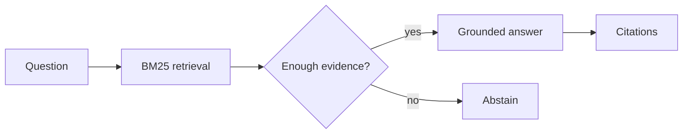

# Grounded RAG

A compact retrieval-augmented generation pipeline that treats citations,
abstention, and evaluation as first-class features. It runs offline, so a
reviewer can clone the repository and see useful output without an API key.

## Why this project exists

Many RAG demos stop after returning plausible text. This project exposes the
engineering decisions that make a system testable: ranked evidence, an explicit
confidence boundary, sentence-level source markers, and retrieval metrics.

## Architecture



## Quick start

```bash
python -m venv .venv
source .venv/bin/activate  # Windows PowerShell: .venv\Scripts\Activate.ps1
python -m pip install -e '.[dev]'
grounded-rag "What is the remote equipment budget?"
grounded-rag --evaluate data/evaluation.json
pytest -q
```

Example evaluation output:

```json
{"recall_at_k": 1.0, "mean_reciprocal_rank": 1.0, "queries": 3}
```

## Design decisions

- **Inspectable retrieval:** BM25 is implemented locally instead of hidden by a framework.
- **Safe failure:** unsupported questions return an abstention, not invented content.
- **Provider boundary:** the `Generator` protocol can wrap OpenAI, Ollama, or another model.
- **Evaluation:** labelled queries measure retrieval recall and reciprocal rank.

## Next extensions

- Add semantic retrieval and compare it against the BM25 baseline.
- Add a reranker and track latency/quality trade-offs.
- Expose `GroundedRAG.ask` through FastAPI with streaming responses.

